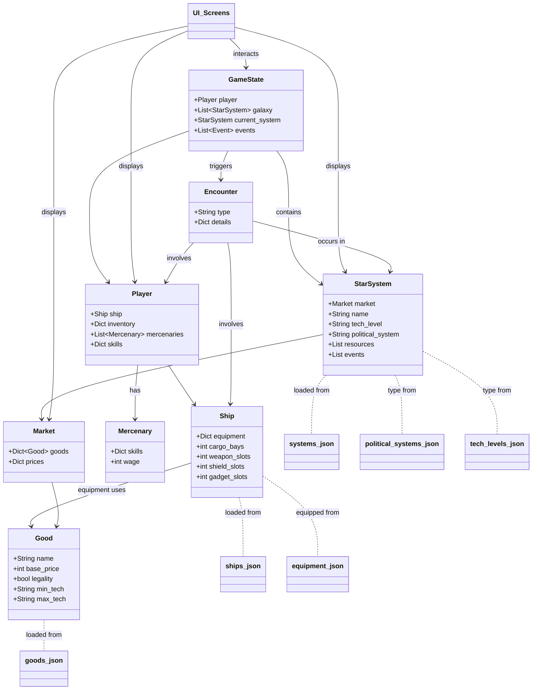

# Space Trader Dependency Graph (Visual)

Below is a UML-style diagram (using Mermaid syntax) that visually represents the relationships and dependencies between the major classes, data files, and UI in the Space Trader TUI project.

---

**How to view:**
- Paste this Mermaid code block into a Markdown editor that supports Mermaid (e.g., VSCode with the Markdown Preview Mermaid plugin, GitHub, or https://mermaid.live/).
- The diagram will render all major classes, UI, and data file dependencies for easy review.

[Back to Dependencies](space_trader_dependencies.md)
